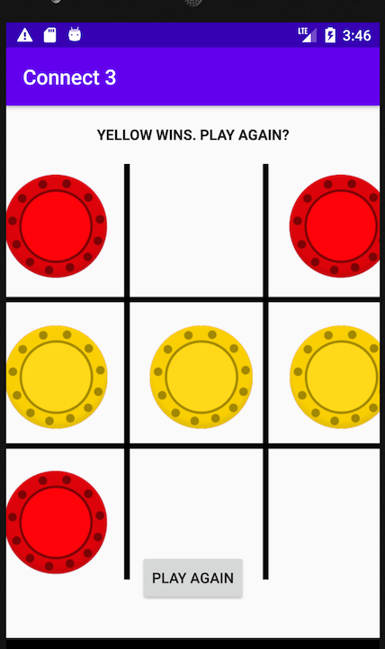

Tic-Tac-Toe with Connect-4 type animation and icons

main code from this is:

int[] gameboard = {0,0,0,0,0,0,0,0,0};
int[][] winningPositions = {{0,1,2}, {3, 4, 5}, {6, 7, 8}, {0, 3, 6}, {1, 4, 7}, {2, 5, 8}, {0, 4, 8}, {2, 4, 6}};
    
void testWhoHasWon() {
        TextView gameStatusText = findViewById(R.id.textGameStatus);
        for (int[] winPositions: winningPositions) {
            if (gameboard[winPositions[0]] == gameboard[winPositions[1]] && gameboard[winPositions[0]] == gameboard[winPositions[2]] && gameboard[winPositions[0]] != 0) {
                if (redTurn) {
                    gameStatusText.setText("Yellow Wins. Play again?");
                } else {
                    gameStatusText.setText("Red Wins. Play again?");
                }
            }
        }
    }
